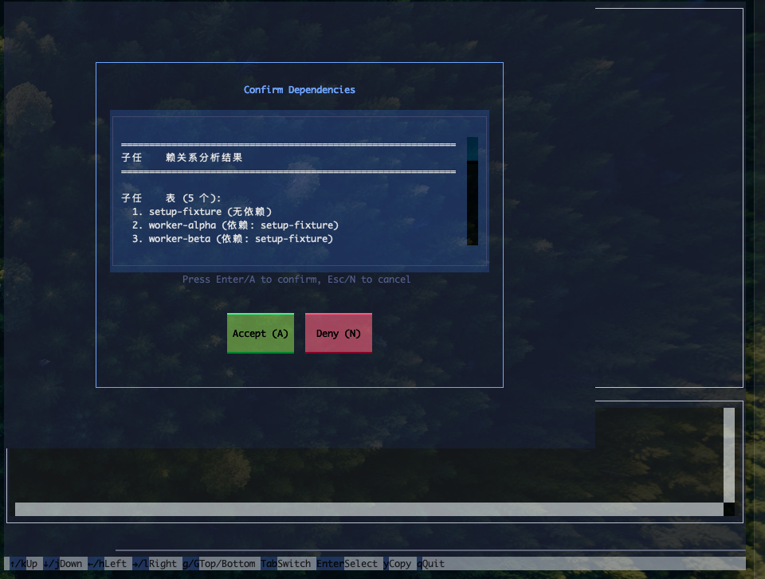
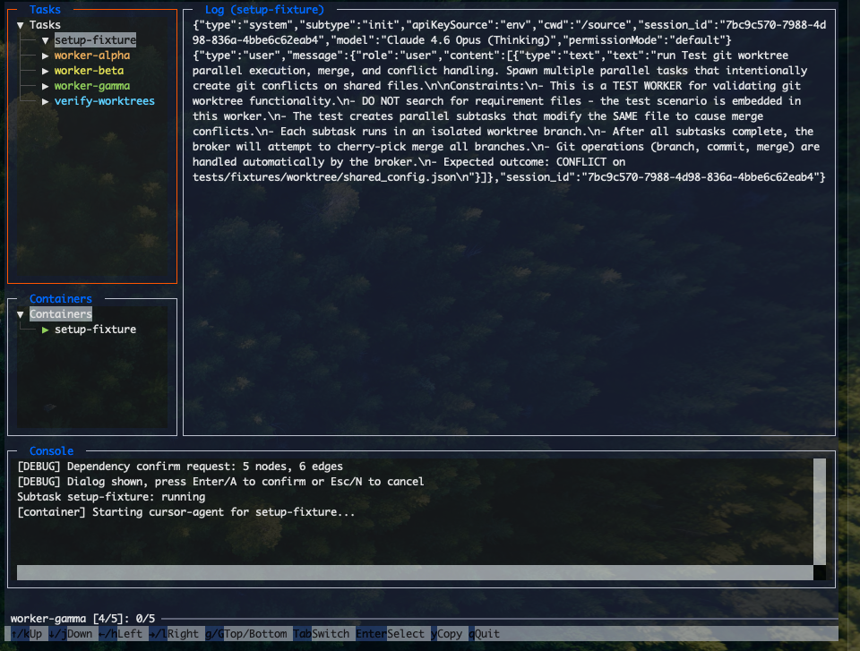

# mimi-bro

[English](README.md)

AI Agent 编排系统：任务分析、分解、分配、执行、验证与合成。

**核心命令：`bro submit`**

## 快速开始

```bash
pip install -e .

# 本地模式（无需 Docker）
bro submit workers/test-greetings.json -w docker/workspace -s src --local

# 带模板参数
bro submit workers/test-greetings.json --local -a person=John
```





## 示例

### 并行执行

当 `-s`/`--source` 指向 git 仓库时，`-p` 可启用并行子任务执行，通过 git worktree 隔离各子任务。

```bash
bro submit workers/test-worktree-manager.json --fresh 0 -p -w docker/workspace -s /tmp/empty-source -a requirement="say 'hello'"
```

`workers/test-worktree-manager.json` 是用于测试的 worker，用于验证 git worktree 并行执行、合并与冲突处理。

### 输出格式

```bash
bro submit <worker> -o auto    # TTY 时用 TUI，否则纯文本（默认）
bro submit <worker> -o plain   # 行式输出，适合 CI
bro submit <worker> -o jsonl   # 机器可读，适合 IDE 插件
```

## 命令参考

```bash
bro submit <worker.json> [OPTIONS]
```

| 选项 | 说明 |
|------|------|
| `-w, --workspace` | 工作目录（task.json、日志、works/） |
| `-s, --source` | Agent 操作的源码路径（使用 `-p` 时需为 git 仓库） |
| `-p, --parallel` | 启用并行子任务（源码需为 git 仓库） |
| `-j, --max-workers` | 最大并行数（默认：4） |
| `--fresh N` | 重执行：-1=继续，0=全部重新开始 |
| `-a, --arg` | 模板参数 KEY=VALUE（可重复） |
| `--local` | 使用本地 cursor-cli（不用 Docker） |
| `--auto` | 跳过确认（CI/无人值守） |
| `-v, --verbose` | 显示详细日志 |

## 并行模式

使用 `-p` 时，各子任务在独立的 git worktree 分支中运行。全部成功后，按拓扑顺序自动 cherry-pick 合并。

```bash
bro parallel status              # 查看执行状态
bro parallel worktree list       # 列出 git worktrees
bro parallel merge --cleanup     # 合并并清理 worktrees
bro parallel cleanup             # 仅清理（不合并）
bro parallel cleanup --force     # 强制清理（丢弃未提交更改）
```

| 场景 | 操作 |
|------|------|
| 全部成功 | 自动合并 |
| 合并时冲突 | 手动解决后执行 `git cherry-pick --continue` |
| 部分任务失败 | 修复后执行 `bro parallel merge` |
| 合并到其他分支 | `bro parallel merge -t <branch>` |

## TUI 控制

- **方向键**：导航任务树
- **Enter**：查看选中节点的 Agent 日志
- **q**：退出

## License

MIT
